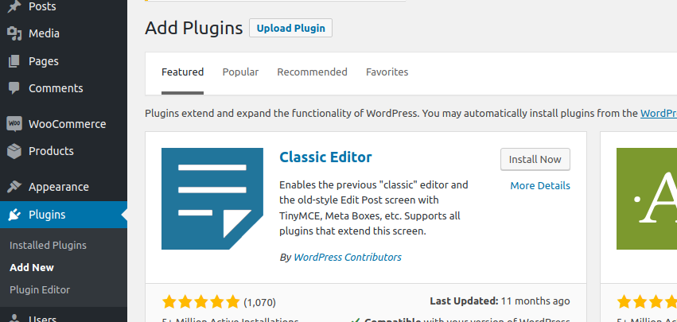
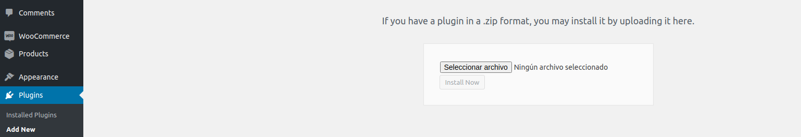

# Paylands plugin
Paylands es una pasarela de pago la cual nos permite hacer diversas operaciones o pagos de una manera segura y eficaz.
Dicho plugin es capaz de realizar una conexión con Paylands para poder realizar pagos online con woocommerce.
Para poder saber más sobre Paylands podéis acceder a la siguiente url: [aquí](https://paylands.com).

## Requisitos para poder usarlo
Recomendamos tener instaladas unas versiones de Wordpress y WooCommerce iguales o superiores a las siguientes:

- Wordpress: 5.2.1
- Woocommerce: 3.5.3

Recuerda que para poder usar paylands, necesitas tener instalado los requisitos previos y tener woocommerce instalado
en la sección de plugins de tu wordpress. Para eso es tan fácil como descargar la versión especificada de woocommerce
[aquí](https://wordpress.org/plugins/woocommerce/advanced/#plugin-download-history-stats) y colocar dicho zip en la sección
de plugins para extraerlo.

Una vez estamos aquí, pulsamos a Upload plugin, y esto nos llevará a la localización donde añadiremos el zip:

## Instalación
Esta sección describe cómo instalar el plugin y hacerlo funcionar. Siga estos pasos:

1. Activa el plugin a través del menú 'Plugins' de WordPress con la casilla de verificación
2. Activar el plugin de Paylands también en el mismo sitio
3. Ir a la configuración de Paylands, y añadir en `Paylands-gateway` todas las credenciales necesarias

